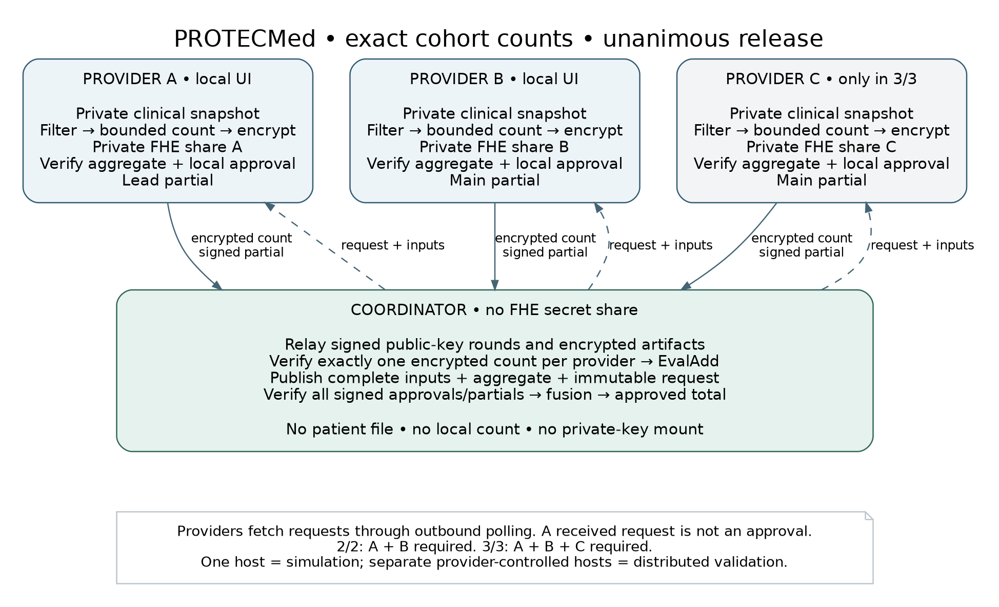

# 1. Product, scope and architecture

## 1.1 PROTECMed in one paragraph

PROTECMed is a platform for privacy-preserving collaboration on medical research data. Its original proposal combines an analytics SDK, a web platform and an interactive release process requiring the data providers' participation [P1]. This prototype implements a deliberately smaller slice: two or three providers count records matching the same approved cohort definition locally, encrypt their respective counts under one jointly generated public key, and let a coordinator add those ciphertexts. The exact aggregate is released only after every provider approves the particular computation and produces its own partial decryption. No Kaplan–Meier, regression or machine learning is included.

**The deliverable is a development specification and reference kit, not a finished or certified clinical system.** The verification ledger distinguishes checks executed during this revision from tests that the programmer must still run. No OpenFHE runtime, Docker image, Windows installation or macOS installation was executed during preparation of this revision.

## 1.2 The MVP contract

The baseline is `cohort-count-local-v2` on profile `bgv-count-nofn-v2`. It performs the predicate in plaintext inside the provider, not at the coordinator. Only one exact integer per provider is encrypted. It demonstrates federated filtering, homomorphic aggregation and unanimous decryption; it does not demonstrate general encrypted database search or fully encrypted patient-level analytics.

| Mandatory | Explicitly deferred |
|---|---|
| 2/2 and 3/3, fixed roster per run | 2/3, dropout recovery, dynamic membership |
| Exact integer counts, BGV, `EvalAdd` | CKKS, multiplication, rotations, bootstrapping |
| One query and one aggregate per fresh key epoch | Repeated decryption oracle under long-lived FHE keys |
| Local XLSX/strict canonical CSV import | EHR, FHIR/OMOP, hospital SSO, native installers |
| Signed artifacts; each provider verifies the aggregate | Proofs that a provider's input is truthful; malicious-secure DKG |
| Minimal local and coordinator browser pages | SPA, dashboards, arbitrary SQL, plug-ins uploaded by users |
| Synthetic tests; restricted IOCN acceptance | Public release of clinical fixtures or query results |

No implementation may silently replace this contract with a centrally generated secret key. `ShareKeys`, `RecoverSharedKey`, the `MultipartyKeyGen(vector<PrivateKey>)` debugging overload and any reconstruction of the complete secret are forbidden in the integrated prototype.

## 1.3 Architecture and trust boundaries

The coordinator is not a data provider and receives no FHE secret share. Party A is the *algorithmic lead* solely because one partial must include the first ciphertext component. A has no additional approval rights. Each provider has one vote and one indispensable secret share.

| Component | Responsibilities | Must not receive or export |
|---|---|---|
| Local party service | Import; validation; approved filtering; local count; human approval; signed protocol messages | No upload of patient rows, local count, local file hash or FHE secret share |
| Local C++ worker | Pinned OpenFHE operations; binary serialization; aggregate recomputation | No network access; no arbitrary cipher operations exposed to users |
| Coordinator service | Freeze run plan; relay public key rounds; verify submissions; add ciphertexts; collect signed partials; fuse approved result | No XLSX/CSV data endpoint; no party data/key mounts |
| Browser | Local provider UI or coordinator status/result UI | No OpenFHE keys or patient tables stored in JavaScript/browser storage |
| Local audit store | State, approvals, immutable outbox and public artifact hashes | No patient rows or counts in central logs |

Party traffic is outbound to the coordinator. The coordinator never calls a network-facing provider decryption API. Providers poll for work, download immutable public/encrypted artifacts and upload signed responses. A poll can announce a request but cannot approve it. The provider's browser calls only its own loopback service.

## 1.4 Data flow

1. A local operator selects a workbook from a preconfigured read-only directory, validates the five-column projection and accepts any cached-formula policy. The agent assigns an opaque local `snapshot_token`; the actual source hash and mapping report stay local.
2. The coordinator prepares a run plan containing the fixed roster, threshold, query hash, mapping hash, snapshot tokens, profile, recipient list and output policy. Every provider checks the same plan and independently pinned identity fingerprints.
3. The coordinator generates the public context; A, B and optionally C extend the public-key chain sequentially. Each creates a private share locally. All providers confirm the identical final epoch manifest before anyone encrypts.
4. Each provider evaluates the frozen query on its frozen local snapshot and submits exactly one signed encrypted count.
5. The coordinator verifies all submissions and computes a deterministic ordered sum. It publishes the exact inputs, their signed manifests and the aggregate in a decryption request.
6. Each provider verifies the signatures, roster and inputs; recomputes the same sum locally; and verifies equality with the requested aggregate. The local operator then chooses Approve or Reject.
7. An approval generates one partial decryption, saves it in a local immutable outbox and uploads the same bytes on retries. The coordinator fuses only after the exact set of n signed, distinct, matching partials is present.
8. The authorized aggregate and an audit receipt are shown to the named recipients. The epoch is closed. A new query requires a new run and new FHE shares.

## 1.5 What “local” and “unanimous” mean

Local means the provider-controlled execution environment, not merely another Docker container under the coordinator's administrator. Three containers on one laptop are useful for a reproducible simulation, but the host administrator can inspect all three. Separate machines and operators are required to demonstrate institutional separation. Container isolation does not defeat a privileged host administrator [S15].

Unanimity is a combination of distributed keys and local policy checks. OpenFHE does not know which hospital signed an approval. The application authenticates parties and verifies the expected roster; the library performs the arithmetic. A missing participant blocks an authorized release. A lost key share requires a fresh epoch, not an administrator bypass.

The baseline trusts providers to run honest key generation and local counting, and trusts their own endpoints and operators. It protects against a curious coordinator under this model and adds concrete integrity checks against accidental or substituted artifacts. It does **not** establish a malicious-secure multiparty protocol.

## 1.6 Reading and implementation order

Read Sections 1–4 before writing application code. Implement milestones M0–M3 before the web UI. Sections 5–7 define the CLI, APIs and deployment contract; Section 8 defines acceptance tests and evidence. Section 9 is the AI-agent workflow. Section 10 is optional extension guidance and must not delay the MVP.

`IMPLEMENTATION_BLUEPRINT.md` is the assembled normative text. The numbered files under `docs/` are the same text split for focused agent tasks. `config/` and `contracts/` provide machine-readable companion artifacts. A disagreement between these files is a release-blocking defect, not permission for an AI agent to choose a convenient interpretation.
