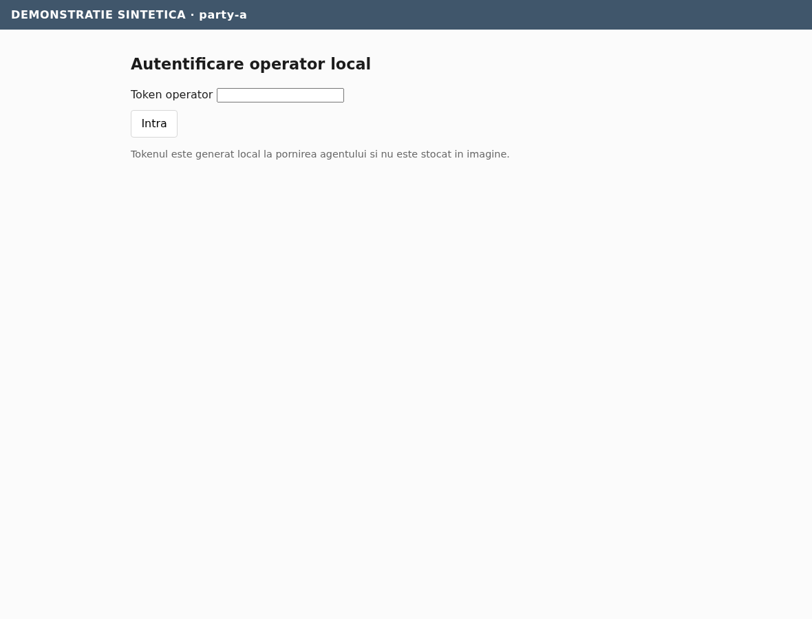
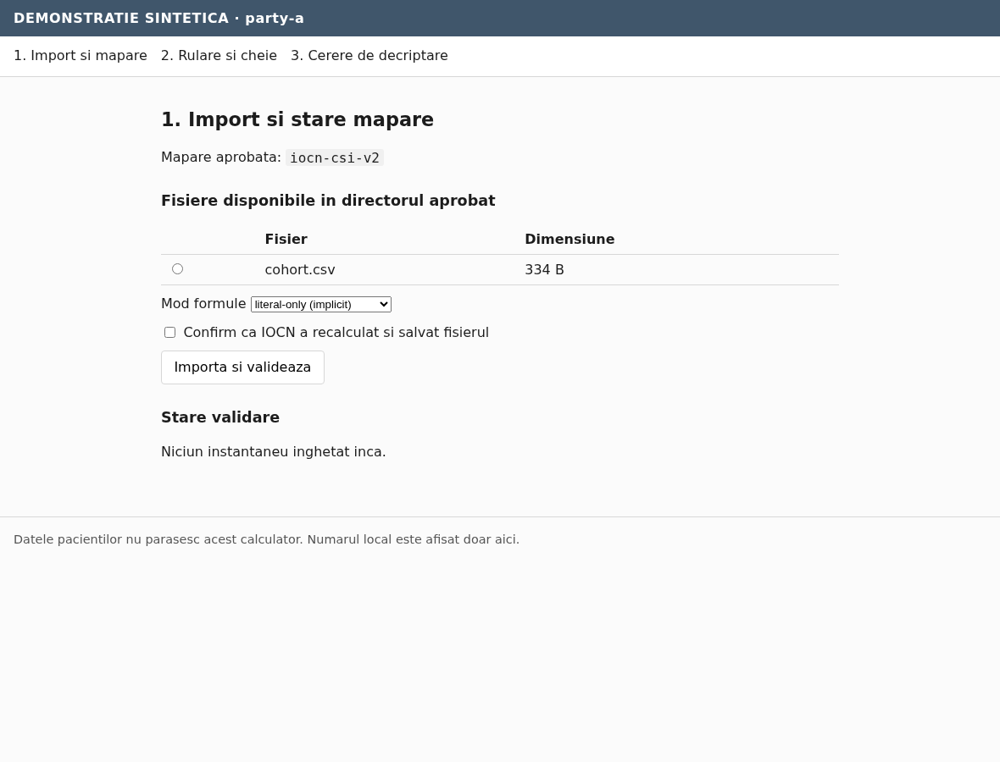
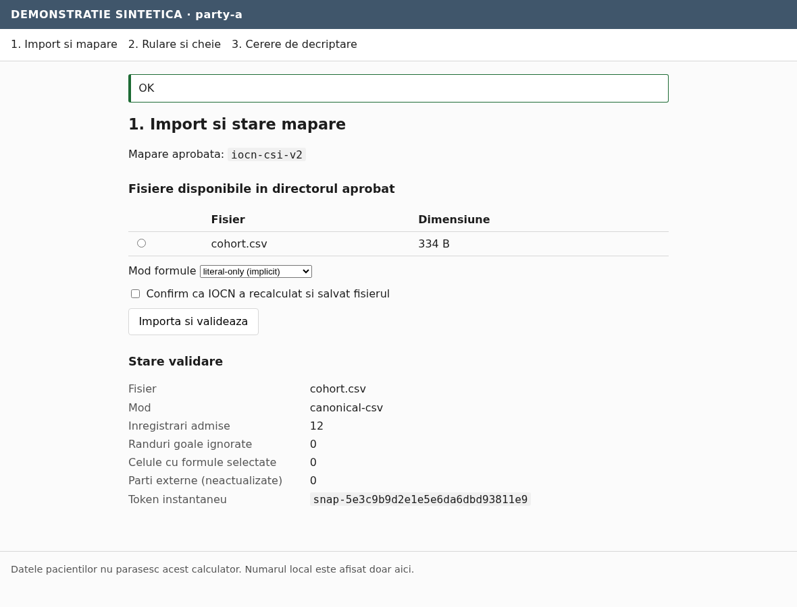
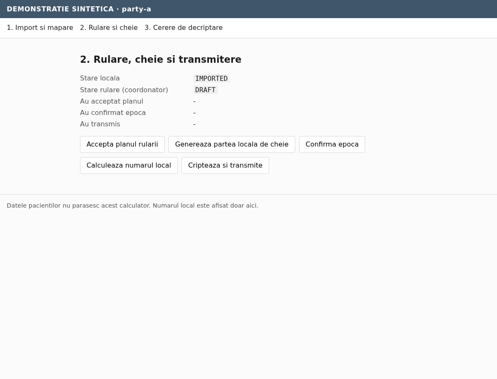
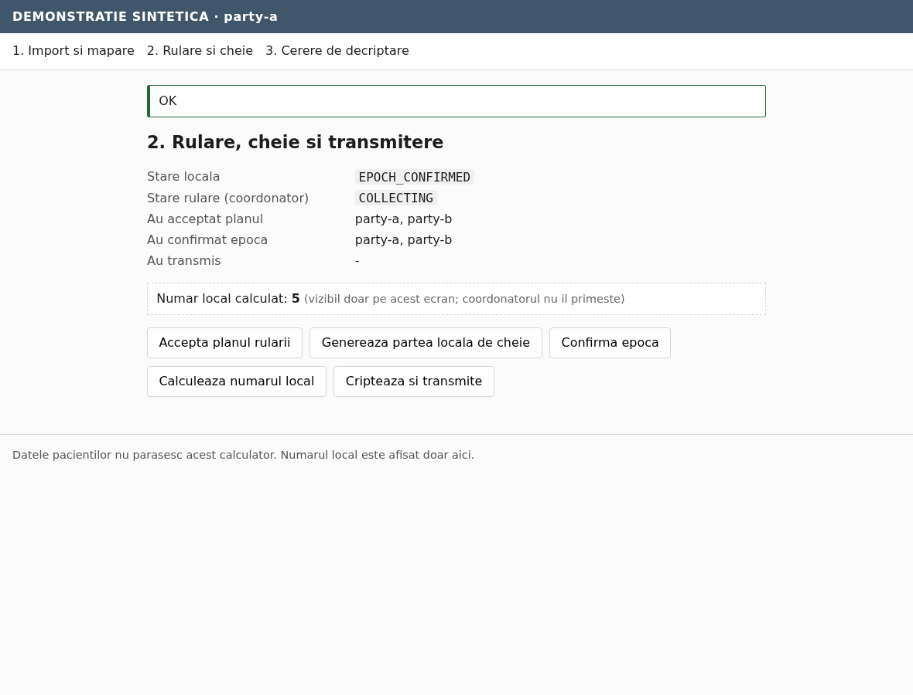
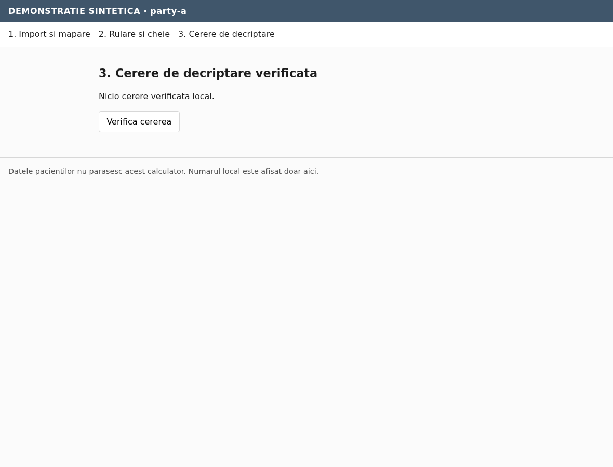
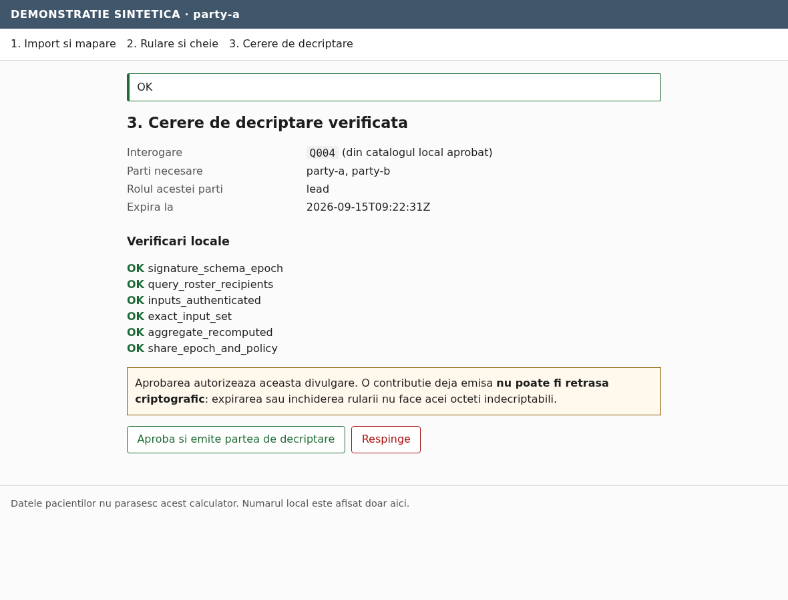
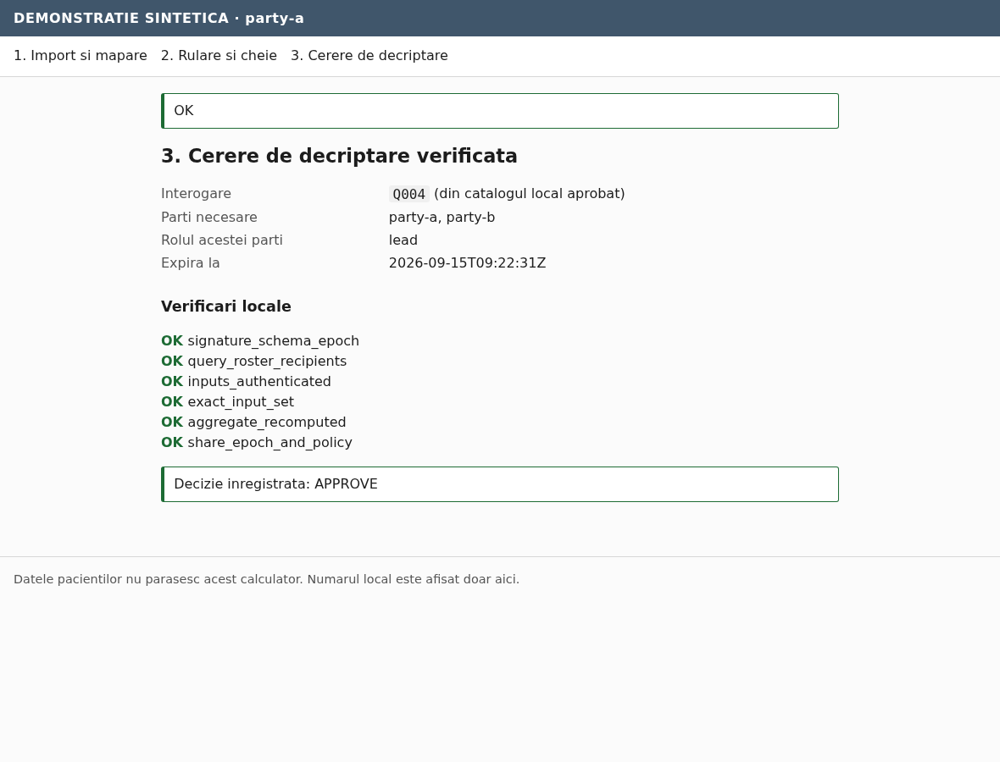

# 4. Role: local provider operator

The person at a data-holding institution. They are the only role that sees clinical data,
and the only role whose approval can release a result.

Interface: three server-rendered screens on `http://127.0.0.1:808X`, loopback only. Labels
are in Romanian; the signed protocol data underneath is not translated.

**What you can do that nobody else can:** refuse. A release needs every provider. If you
do not approve, no result exists.

**What you cannot undo:** an approval. Once your partial decryption has left this machine
it cannot be recalled cryptographically. An expiry timestamp, a closed run or a deleted
page cannot make those bytes undecryptable.

---

## 4.1 Log in

The token is printed by the launcher at start-up. It is generated on this endpoint at
runtime and is not stored in the repository or in any image; it changes on every restart.

The session cookie is `HttpOnly`, `SameSite=Strict` and named for this agent
(`protecmed_session_party_a`), because two agents on different ports of the same host do
not otherwise get separate cookies.

---

## 4.2 Screen 1 — Import and mapping status

The table lists the files in the **configured read-only import directory**. Nothing else
can be imported: the form submits an opaque token, not a path, and an arbitrary path is
refused with `UNKNOWN_SELECTION_TOKEN`. Symlinks and anything that is not a regular
`.xlsx` or `.csv` file are not listed.

**Mod formule** picks the formula policy — see [Configure §2.5](02-configure.md#25-formula-mode).
Leave it on `literal-only` unless the data owner has confirmed the workbook was
recalculated and saved, in which case also tick the acknowledgement box.

Select the file and press **Importa si valideaza**.

The validation report is local and stays local:

| Field | Meaning |
|---|---|
| Inregistrari admise | Records admitted — at least one of the five selected fields is non-blank |
| Randuri goale ignorate | Rows skipped because all five selected cells were blank |
| Celule cu formule selectate | Formula cells among the selected clinical cells |
| Parti externe (neactualizate) | External-link parts present in the workbook, counted and **never followed** |
| Token instantaneu | The opaque snapshot token — the only thing here that leaves the machine |

The snapshot is now **frozen**. Editing the source file afterwards does not change what
you already contributed. Re-importing mints a new token and supersedes the old snapshot,
invalidating any unfinished run that used it.

Give the coordinator operator your snapshot token and your identity fingerprint. Send them
nothing else.

---

## 4.3 Screen 2 — Run, key and submission

Five actions, in order. The buttons are always visible; the services enforce the ordering,
so an action taken too early returns a notice rather than doing something wrong.

**1. Accepta planul rularii.** The agent checks the coordinator's signature and verifies
that the plan matches what you already hold: your snapshot token, the query hash, the
mapping hash, and every roster identity fingerprint you pinned out of band. A mismatch is
refused. It also refuses a plan whose query is not in your **local** catalogue.

**2. Genereaza partea locala de cheie.** Runs the key round for this party. The secret
share is written to this machine only. Party order matters — see
[§3.2](03-run-the-demo.md#32-the-sequence).

**3. Confirma epoca.** Verifies the whole key-round chain, including your own
contribution, checks that the context and final public key hash to what the manifest says,
then signs the confirmation. Encryption cannot start until every provider has confirmed.

**4. Calculeaza numarul local.** Evaluates the frozen query against the frozen snapshot.

> **Numar local calculat: 5** — *vizibil doar pe acest ecran; coordonatorul nu il primeste.*

This number is shown **only here**, on your authenticated screen. It is never uploaded,
never logged centrally and never appears in a signed payload. The coordinator's run view
has no field for it.

**5. Cripteaza si transmite.** Encrypts exactly one integer under the joint public key and
uploads it with a signed manifest. A retry resends the identical bytes.

The status list at the top shows which parties have accepted, confirmed and submitted, so
you can see whether you are waiting for someone else.

---

## 4.4 Screen 3 — Verified decryption request

Press **Verifica cererea**. Nothing is presented for approval until your own agent has
independently checked it.

The six checks, in the order they run:

| Check | What your agent verified |
|---|---|
| `signature_schema_epoch` | The coordinator's signature, the schema, the purpose, that the request has not expired, and that it names the run and epoch you pinned |
| `query_roster_recipients` | The query hash, the exact roster, the lead party and the recipient list all match your local records |
| `inputs_authenticated` | Every provider's submission signature and ciphertext hash — **including your own contribution, byte for byte** |
| `exact_input_set` | Exactly one input per required party, in roster order, with no omissions, duplicates or extras, matching the committed input-set hash |
| `aggregate_recomputed` | Your agent re-added those exact inputs locally and compared the **cryptographic object**, not just a hash. A subset sum, a substituted input or a re-randomized result fails here |
| `share_epoch_and_policy` | Your key share belongs to this epoch, you have emitted no earlier partial, and your local disclosure ledger permits this query, snapshot and recipient combination |

The query line reads *(din catalogul local aprobat)* — it is rendered from **your**
catalogue. A description written by the coordinator is never displayed as the query.

### Approve or Reject

> *Aprobarea autorizeaza aceasta divulgare. O contributie deja emisa **nu poate fi retrasa
> criptografic**: expirarea sau inchiderea rularii nu face acei octeti indecriptabili.*

- **Aproba si emite partea de decriptare** — produces your partial decryption and uploads
  it. This is the irreversible step.
- **Respinge** — records a signed rejection. **No partial is produced**, and the
  coordinator cannot fuse while a rejection stands.

Once a decision is recorded the buttons are gone. Asking to verify again returns
`PARTIAL_ALREADY_EMITTED`: a second, different partial for the same epoch is impossible by
construction. If your upload was lost in transit, the stored bytes are resent — the
cryptographic operation is not repeated.

---

## 4.5 Before you approve on real data

The technical checks above prove the computation is the approved one over the exact input
set. They do **not** prove:

- that another provider counted honestly, or used its correct share — the baseline trusts
  providers for that;
- that the result is safe to disclose. An exact two-provider total reveals the other
  provider's count to anyone who knows one of them. In a three-party run, two colluding
  providers can infer the third. That is arithmetic, not a break of the encryption, and
  nothing in this software hides it.

Small-cohort suppression in a coordinator screen would not help: the coordinator holds the
number after fusion. Deciding that a specific small aggregate may be released to a specific
recipient list is a human decision that belongs to the data owner, before the demonstration.

Next: [Role: coordinator operator](05-role-coordinator.md).
